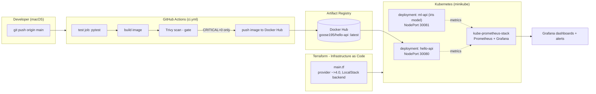

# DevOps Roadmap Journal

A hands-on, day-by-day journey through the modern DevOps toolchain — from a monorepo of journal notes to a real, repeatable platform: two containerized services, gated CI/CD, infrastructure-as-code, Kubernetes deployment, and observability. Every line was written and run on a real machine (macOS + Docker Desktop), not copied from a tutorial.

## What This Project Demonstrates

- **Full CI/CD pipeline**: `git push → GitHub Actions (test → Trivy security gate → build → push to Docker Hub)` — a change literally cannot ship with a CRITICAL vulnerability.
- **Two real services on Kubernetes (minikube)**:
  - `hello-api` — a FastAPI app (CI-built and pushed).
  - `ml-api` — a trained **scikit-learn Iris classifier** wrapped in FastAPI, serving predictions through the exact same pipeline pattern (Day 9: MLOps-lite).
- **Infrastructure as code** with Terraform (demonstrated against LocalStack for zero cost — same `main.tf` applies to real AWS).
- **Observability**: kube-prometheus-stack (Prometheus + Alertmanager + Grafana) monitoring cluster/pod resources, with the load test shown as live CPU spikes.
- **Rolling deployments with zero downtime**, verified by running traffic through a live `kubectl rollout`.

## Architecture



*(Rendered as a diagram on GitHub; source in [architecture.md](architecture.md).)*

## Tools Used

| Tool | What it's used for |
|---|---|
| **Git / GitHub** | Version control, feature branches, PRs, Actions, secret scanning |
| **Docker** | Containerizing both services (multi-stage builds, non-root runtime) |
| **Kubernetes (minikube)** | Deployments, Services, rolling updates on the local cluster |
| **GitHub Actions** | CI/CD: `test → Trivy gate → build → push` on every merge to `main` |
| **Docker Hub** | Image registry where clean builds land |
| **Terraform** | IaC against LocalStack (S3 bucket + EC2), destroyed after each session |
| **Prometheus / Grafana** | Cluster & app observability, dashboards, symptom-based alerting |
| **Trivy** | Image vulnerability scanning as a CI enforcement gate |
| **FastAPI / scikit-learn** | The apps: hello-api and the iris classifier served as an API |
| **Helm** | Installing the kube-prometheus-stack monitoring suite |

## Day-by-Day Notes

| Day | Topic | Notes |
|---|---|---|
| 1 | Git & the DevOps mental model | [day1.md](day1.md) |
| 2 | Linux & shell scripting (healthcheck) | [day2.md](day2.md) |
| 3 | Docker & containers | [day3.md](day3.md) |
| 4 | Kubernetes (minikube) | [day4.md](day4.md) |
| 5 | CI/CD with GitHub Actions | [day5.md](day5.md) |
| 6 | IaC with Terraform (LocalStack) | [day6.md](day6.md) |
| 7 | Monitoring & observability | [day7.md](day7.md) + [doc/day7-notes.md](doc/day7-notes.md) |
| 8 | Security & DevSecOps (Trivy gate, hardening) | [day8.md](day8.md) + [doc/day8-notes.md](doc/day8-notes.md) |
| 9 | AI/ML deployments (MLOps-lite) | [day9.md](day9.md) + [doc/day9-notes.md](doc/day9-notes.md) |
| 10 | Capstone: end-to-end pipeline | *(in progress — see [architecture.md](architecture.md))* |

## Repo Layout

```
hello-api/        FastAPI app + tests (CI build & push target)
ml-api/           Iris model + training + FastAPI serving (model.joblib committed)
k8s/              Deployment & Service manifests for both apps
terraform/        main.tf for LocalStack-backed AWS IaC (state is gitignored)
.github/workflows/ci.yml    Test → Trivy → build → push
doc/              Extended day-by-day operation notes
```